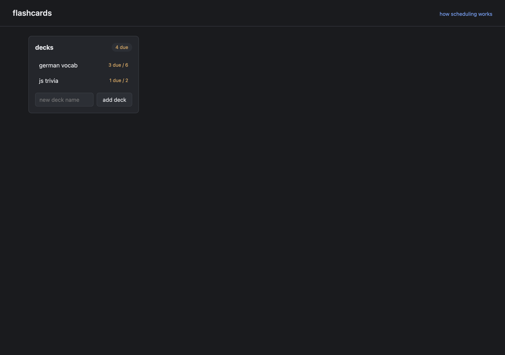

# flashcards



a small spaced-repetition flashcards app, plain html/css/js. everything lives in localStorage so you can just open `index.html` and start using it.

i wanted an excuse to actually implement sm-2 by hand instead of using a library, so this is mostly that.

## what's in here

- decks with cards (front/back)
- study mode: see the front, click to flip, grade with again/hard/good/easy
- per-card ease factor, interval, repetition count, next review timestamp
- a "due today" pill in the deck list
- a small panel showing each card's ease and current interval

## the scheduling bit

sm-2 (the algorithm anki is built on top of). quality is mapped from the four buttons:

```
again = 0
hard  = 3
good  = 4
easy  = 5
```

then for each review:

```
ease' = ease + (0.1 - (5 - q) * (0.08 + (5 - q) * 0.02))
ease' = max(ease', 1.3)
```

if `q < 3`, the card resets: interval back to 1 day, repetition counter to 0. otherwise the first successful review schedules the card 1 day out, the second schedules it 6 days out, and from then on the new interval is `previous_interval * ease`. next review is just `now + interval days`.

i kept the rounding to whole days because the table looks nicer that way. there's also an "how scheduling works" link in the header that opens a short explanation.

## running it

```
git clone https://github.com/secanakbulut/flashcards.git
cd flashcards
open index.html
```

no build step, no dependencies. on linux/windows just double-click `index.html` or serve the folder with any static server.

## keyboard shortcuts

inside study mode:

- space or enter: flip the card
- 1: again, 2: hard, 3: good, 4: easy

## files

- `index.html` — markup
- `style.css` — styles
- `sm2.js` — the scheduling math, isolated so it's easy to read
- `app.js` — everything else: state, rendering, study session

## notes

state key in localStorage is `flashcards.v1`. if you want to wipe everything, clear that key in devtools.

released under polyform noncommercial 1.0.0, see `LICENSE`. fine for personal study, not for selling.
